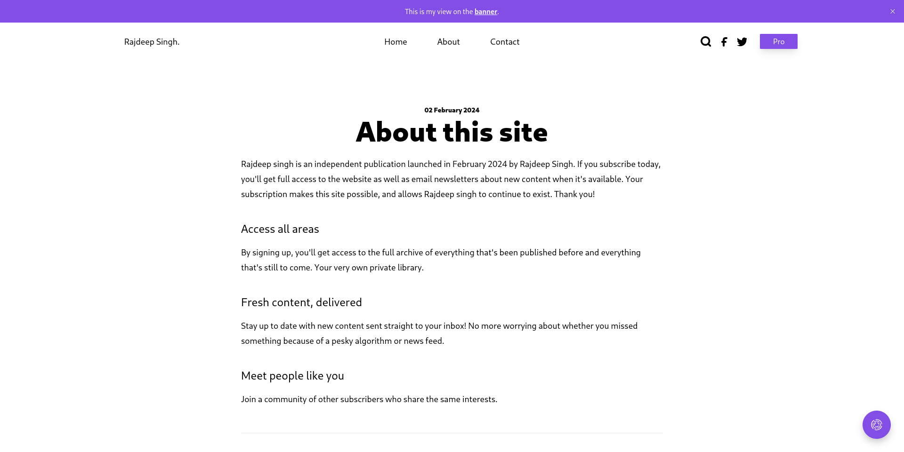
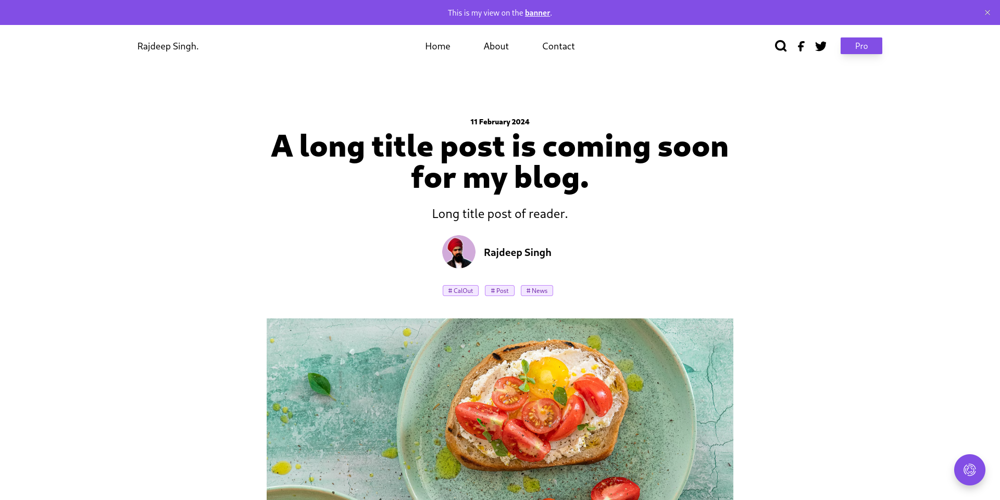
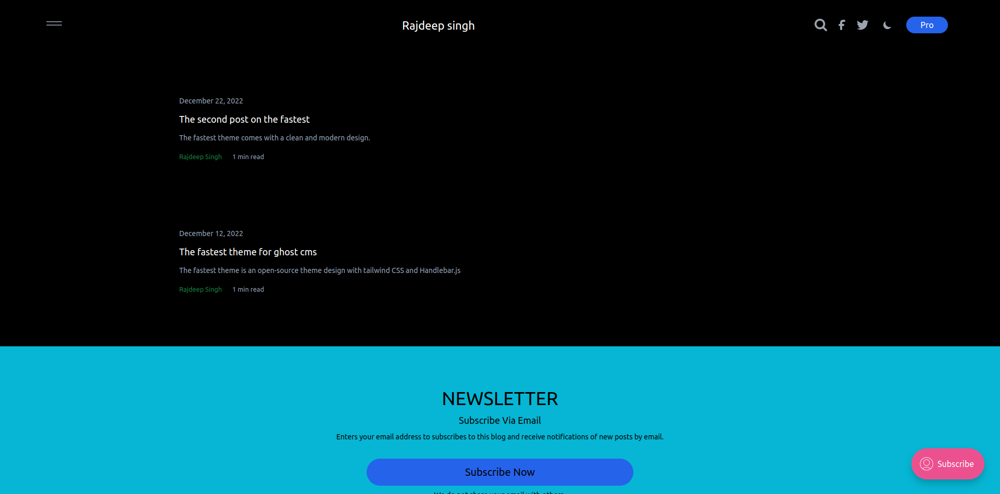
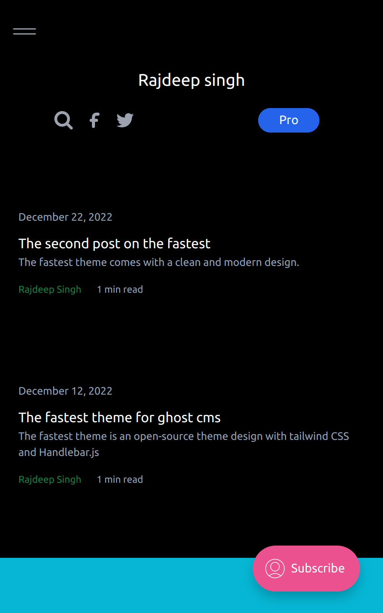

# Fastest

Minimal, fast Ghost theme with Tailwind CSS and dark mode.

## Demo

## Install (zip from latest release)

1. Visit the latest releases page: https://github.com/frontendweb3/fastest/releases/latest
2. Download the packaged theme zip (e.g., `fastest-3.0.3.zip`).
3. In Ghost Admin: `Settings → Design → Change theme → Upload theme`, pick the downloaded zip, then Activate.

## Install (from source)

1. `git clone https://github.com/frontendweb3/fastest.git && cd fastest`
2. `pnpm install` (or `npm install` / `yarn install`)
3. Build or watch assets:
    - Install package: `pnpm install`
	- Watch: `pnpm dev`
	- Build: `pnpm build`
4. Upload the generated zip (if you create one) or the repo zip via Ghost Admin as above.

## Customization

- Configure colors, logos, and toggles in Ghost Admin → Settings → Design → Theme settings.
- Typography and prose colors respect the theme custom settings for light/dark modes.
- Includes search, comments, code highlighting, and responsive cards.
