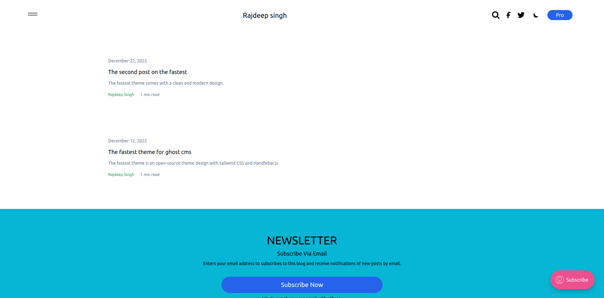

# Installing the fastest theme

You can create your own ghost theme. To create a theme with ghost. you have the latest version of `ghost-cli` in your laptop.

## Demo of fastest

---

---

## Installing fastest theme

### How to install fastest theme in the ghost?

You install fastest theme by manually. first download code into github repo and then follow the steps.

1. clone the repo with following command `git clone https://github.com/frontendweb3/fastest` or download code for repo the [fastest](https://github.com/frontendweb3/fastest).
2. Go to the ghost dashboard > settings > design > change-theme > click on upload button > activate the fastest theme.

## What kind thing change fastest theme?

You can add social media link, adsense Enable and disable, copyright, theme .

## How to add adsense in blog?

You can paste your Adsense code into `partials/ads.hbs` file and then enable Adsense dashboard > settings > design > Site-wide > click on adsense enable button and select enable.

## Version

All changelogs help to improve website speed and user experience.

### Dec 22 2020

* Reduce the javascript and CSS
* Enable comment and search
* Remove third nav bar
* Improve the website design
* Enable dark and light mode
* Fix other issue

### Jun 14 2022

* Fix ads and reduce css
* Remove ads block detector

### March 30 2022

* fix ads block issue on website

### March 28 2022

* Remove Jquery
* Improve search functionally
* Disable adblock
* adblock detected and add custom adsense_adblock_enable property
* fix small issue in css and design

### March 21 2022

* Add color support in custom setting
* fix small issue in css and design

### March 20 2022

* update author social links on post page

### March 17 2022

* Add basic subscribe section
* improve css

### March 13 2022

* Improve page layout

### March 12 2022

* Image page speed bug fix.

### March 10 2022

* Improve website CSS
* Compress CSS and JS file
* Config the search API  in theme
